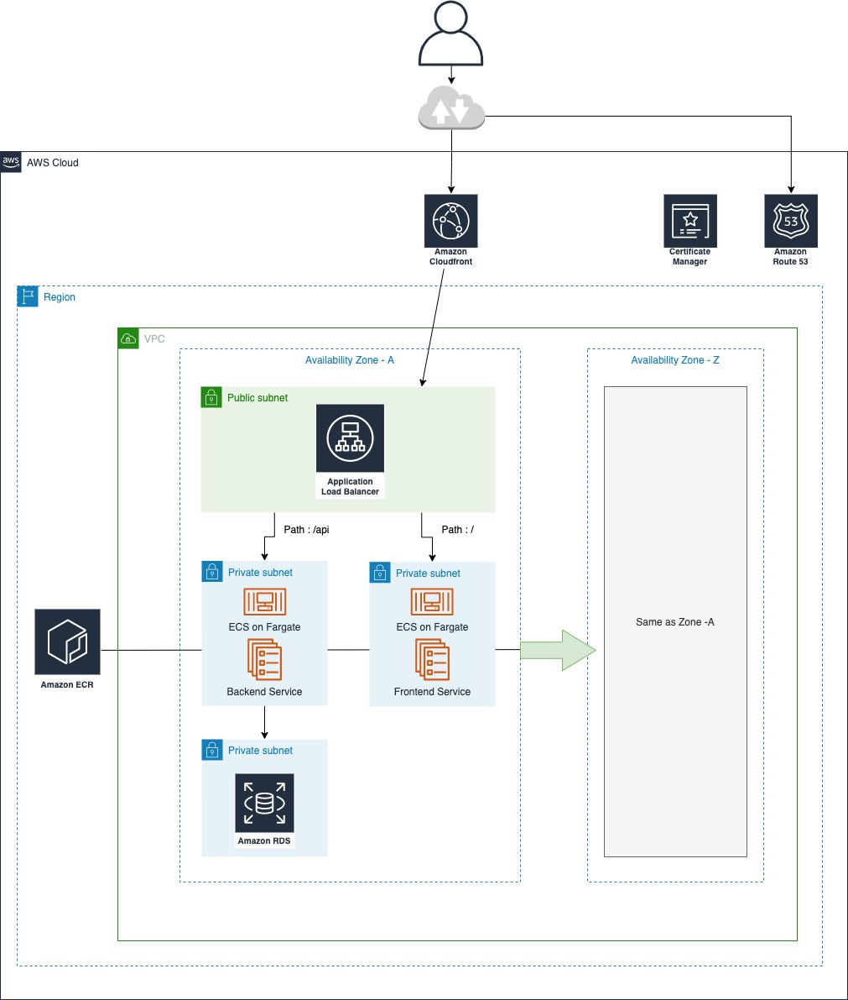

# oflaic-terraform

### Assumptions and alterations

- Terraform cloud will be used as both state and runner backend, otherwise remote state module needs to added.
- For each environment one workspace will created on TF Cloud with required variables.
- ECS cluster is running on AWS Fargate to reduce work on maintaining EC2 instances and auto scaling groups
- Did not add cloudfront route53 acm as pointed in diagram.
- API Gateways could be used with APIGW->NLB->ECS with private links.
- Did not add ecs service for frontend currently ALB returning static response
- Backend initially runs as much as a-z count.
- TF documents can be found under [docs](./docs) folder




### Quick start

For all commands run : 
```
make help
```
**Important** Most of the make commands requires docker workspace for dependencies

#### Get workspace container shell

It provides :

- [terraform](https://www.terraform.io/docs/cli/code/index.html)
- [terraform-docs](https://github.com/terraform-docs/terraform-docs)
- [tfsec](https://github.com/tfsec/tfsec)
- [tflint](https://github.com/terraform-linters/tflint) with [aws ruleset](https://github.com/terraform-linters/tflint-ruleset-aws)
- [terraform-docs](https://github.com/terraform-docs/terraform-docs)
- [terraform-compliance](https://github.com/terraform-compliance/cli)
- [aws cli](https://docs.aws.amazon.com/cli/index.html)

Also maps from host:

  - [ENV] AWS_PROFILE=$AWS_PROFILE
  - [VOLUME] $HOME/.aws/credentials:/root/.aws/credentials
  - [VOLUME] $PROJECT_DIR:/opt/workspace/

To see all commands :

```bash
make help
```
To run workspace :
```bash
 export AWS_PROFILE="AWS_PROFILE_TO_RUN"
 make shell
```

#### Initialise terraform
```bash
 make tf-init
```

#### Plan changes
```bash
make tf-plan
```

#### Apply 
```bash
make tf-apply
```

#### Destroy 
```bash
make tf-destroy
```

#### Pre Commit 
```bash
make pre-commit
```

#### (Danger) Clean everything including state files 
```bash
make clean
```


### Todo

- ECR registry
- CodePipeline for builds
- Add TLS Support
- Cloudfront
- Route53
- API Gateway 
